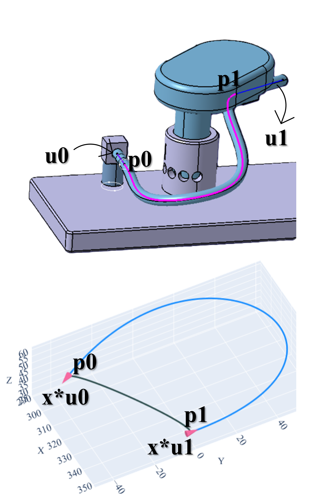
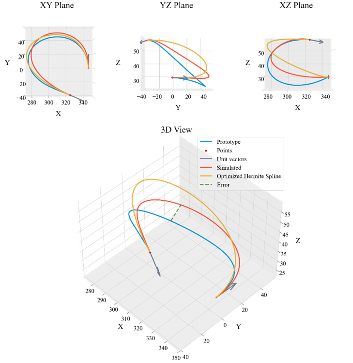

## Arc Length Constrained Hermite {.smaller}

 

Min. $f(x)$ = $L($ Hermite ( p~0~ , p~1~ , x\* u~0~ , x\* u~1~ )  $)$ – $L($ Prototype $)$

 

*where,*

$L( )$ : Length function

p~0~ &nbsp;&nbsp;&nbsp;: Starting point

p~1~ &nbsp;&nbsp;&nbsp;: Ending point

u~0~ &nbsp;&nbsp;&nbsp;: Unit Tangent at p0

u~1~ &nbsp;&nbsp;&nbsp;: Unit Tangent at p1

x &nbsp;&nbsp;&nbsp;&nbsp;&nbsp;: Magnitude for u~0~ & u~1~ (Optimization Variable)

{.absolute top="21%" left="63%" width="300"}

## Position 1 - Case 1 {.r-stretch}



## Position 1 - Case 2 {.r-stretch}



## Position 1 - Case 3 {.r-stretch}



## Position 2 - Case 1 {.r-stretch} 



## Position 2 - Case 2 {.r-stretch} 



## Position 2 - Case 3 {.r-stretch}



## Position 3 - Case 1 {.r-stretch} 



## Position 3 - Case 2 {.r-stretch} 



## Position 3 - Case 3 {.r-stretch}



## Position 4 - Case 1 {.r-stretch}



## Position 4 - Case 2 {.r-stretch}



## Position 4 - Case 3 {.r-stretch}



## Error Metrics {.smaller style="text-align: center; font-size: 75%;"}

<table class="dataframe">
  <thead>
    <tr style="font-size: 85%;">
      <th>Position</th>
      <th>Case</th>
      <th>End Tangent Magnitude</th>
      <th>Length - Prototype</th>
      <th>Length - Optimized Hermite</th>
      <th>Error - Midpoint Deviation</th>
      <th>Error - Length</th>
    </tr>
  </thead>
  <tbody>
    <tr style="font-size: 75%;">
      <td>1</td>
      <td>1</td>
      <td>339.231</td>
      <td>192.160</td>
      <td>192.160</td>
      <td>27.232</td>
      <td>0.0</td>
    </tr>
    <tr style="font-size: 75%;">
      <td>1</td>
      <td>2</td>
      <td>428.425</td>
      <td>183.671</td>
      <td>183.671</td>
      <td>29.464</td>
      <td>0.0</td>
    </tr>
    <tr style="font-size: 75%;">
      <td>1</td>
      <td>3</td>
      <td>410.361</td>
      <td>217.601</td>
      <td>217.601</td>
      <td>24.393</td>
      <td>0.0</td>
    </tr>
    <tr style="font-size: 75%;">
      <td>2</td>
      <td>1</td>
      <td>326.361</td>
      <td>192.181</td>
      <td>192.181</td>
      <td>31.582</td>
      <td>0.0</td>
    </tr>
    <tr style="font-size: 75%;">
      <td>2</td>
      <td>2</td>
      <td>375.337</td>
      <td>183.667</td>
      <td>183.667</td>
      <td>22.649</td>
      <td>0.0</td>
    </tr>
    <tr style="font-size: 75%;">
      <td>2</td>
      <td>3</td>
      <td>430.615</td>
      <td>217.588</td>
      <td>217.588</td>
      <td>31.889</td>
      <td>0.0</td>
    </tr>
    <tr style="font-size: 75%;">
      <td>3</td>
      <td>1</td>
      <td>329.663</td>
      <td>192.184</td>
      <td>192.184</td>
      <td>37.735</td>
      <td>0.0</td>
    </tr>
    <tr style="font-size: 75%;">
      <td>3</td>
      <td>2</td>
      <td>346.258</td>
      <td>183.675</td>
      <td>183.675</td>
      <td>21.762</td>
      <td>0.0</td>
    </tr>
    <tr style="font-size: 75%;">
      <td>3</td>
      <td>3</td>
      <td>444.335</td>
      <td>217.567</td>
      <td>217.567</td>
      <td>44.350</td>
      <td>0.0</td>
    </tr>
    <tr style="font-size: 75%;">
      <td>4</td>
      <td>1</td>
      <td>349.239</td>
      <td>192.240</td>
      <td>192.240</td>
      <td>40.860</td>
      <td>0.0</td>
    </tr>
    <tr style="font-size: 75%;">
      <td>4</td>
      <td>2</td>
      <td>331.333</td>
      <td>184.719</td>
      <td>184.719</td>
      <td>24.860</td>
      <td>0.0</td>
    </tr>
    <tr style="font-size: 75%;">
      <td>4</td>
      <td>3</td>
      <td>458.466</td>
      <td>217.558</td>
      <td>217.558</td>
      <td>49.024</td>
      <td>0.0</td>
    </tr>
  </tbody>
</table>

::: {style="font-size: 70%; text-align: right;"}
***^Units: mm***
:::

## Cosserat Rod Theory {.smaller}

**Conservation of Linear Momentum:** 

$$
\small{\rho A \cdot \partial_t^2 \bar{\mathbf{r}} = \overbrace{\partial_s \left( \frac{\mathbf{Q}^T \mathbf{S} \boldsymbol{\sigma}}{e} \right)}^{\substack{\text{internal shear/} \\ \text{stretch force}}} + \overbrace{e \ \bar{\mathbf{f}}}^{\substack{\text{external} \\ \text{force}}} }
$$

**Conservation of Angular Momentum:** 

$$
\small{\begin{align}\frac{\rho \mathbf{I}}{e} \cdot \partial_t \boldsymbol{\omega}&=\overbrace{\partial_s \left( \frac{\mathbf{B} \boldsymbol{\kappa}}{e^3} \right) + \frac{\boldsymbol{\kappa} \times \mathbf{B} \boldsymbol{\kappa}}{e^3}}^{\text{internal bend/twist couple}}+\overbrace{\left( \mathbf{Q}\frac{\bar{\mathbf{r}}_s}{e} \times \mathbf{S} \boldsymbol{\sigma} \right)}^{\substack{\text{internal shear/} \\ \text{stretch couple}}}+\overbrace{\left( \rho \mathbf{I} \cdot \frac{\boldsymbol{\omega}}{e} \right) \times \boldsymbol{\omega}}^{\text{Lagrangian transport}}+\overbrace{\frac{\rho \mathbf{I} \boldsymbol{\omega}}{e^2} \cdot \partial_t e}^{\text{unsteady dilation}}+\overbrace{e \ \mathbf{c}}^{\substack{\text{external} \\ \text{couple}}}
\end{align}}
$$

By solving these equations with suitable boundary conditions, we can model the dynamics of a single Cosserat elastic rod.

::: aside
M. Tummers, et. al., "Cosserat Rod Modeling of Continuum Robots from Newtonian and Lagrangian Perspectives," in IEEE Transactions on Robotics, vol. 39, no. 3, pp. 2360-2378, June 2023, doi: 10.1109/TRO.2023.3238171.
:::

## Position 1 - Case 1 - Cosserat Rod {.smaller}

::::: {.columns}
:::: {.column width="45%"}

|                    | Prototype | Hermite | Cosserat |
|--------------------|-----------|---------|----------|
| Length             | 192.160   | 192.160 | 192.153  |
| Error Length       | -         | 0.0     | 0.007    |
| Midpoint Deviation | -         | 27.232  | 10.421   |

::: {style="font-size: 70%; "}
***^Units: mm***
:::

::::

:::: {.column width="45%"}

{.absolute top="15%" left="55%" width="500"}

::::

:::::