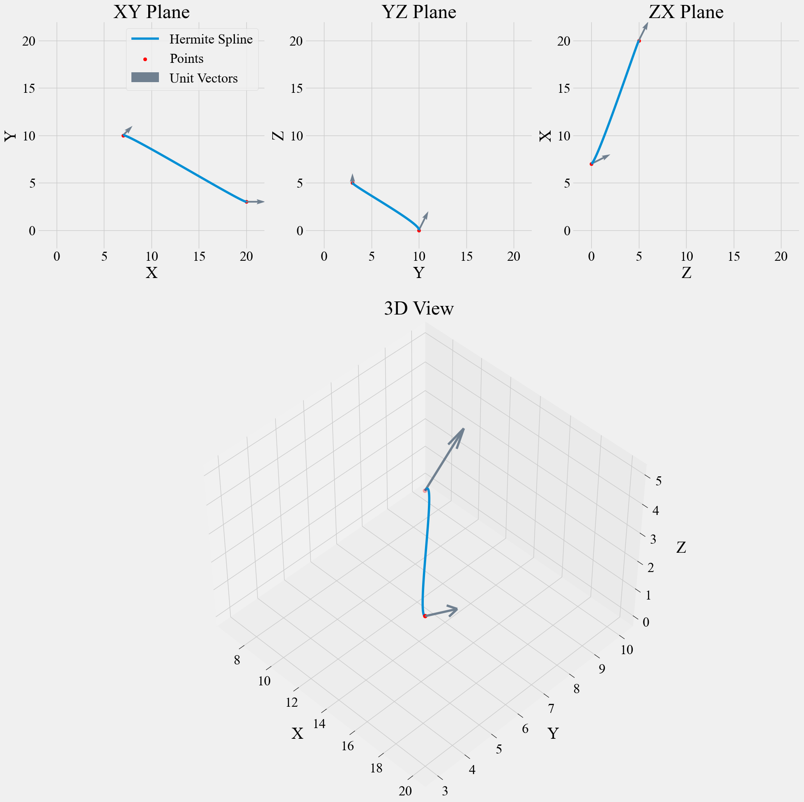
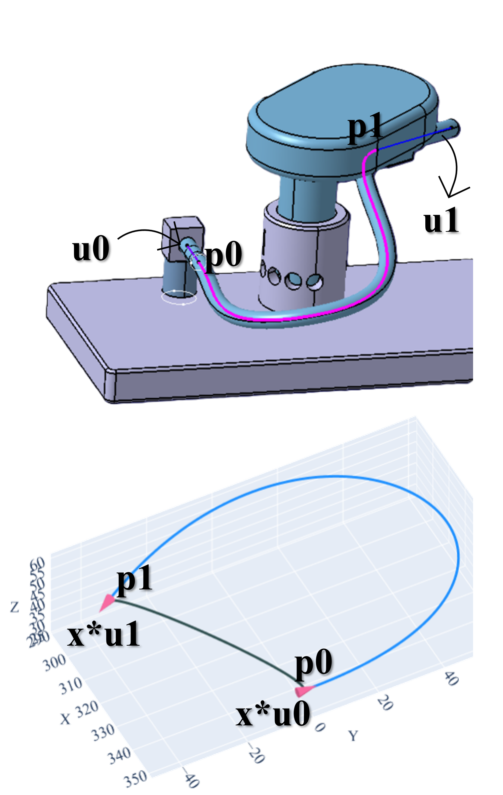
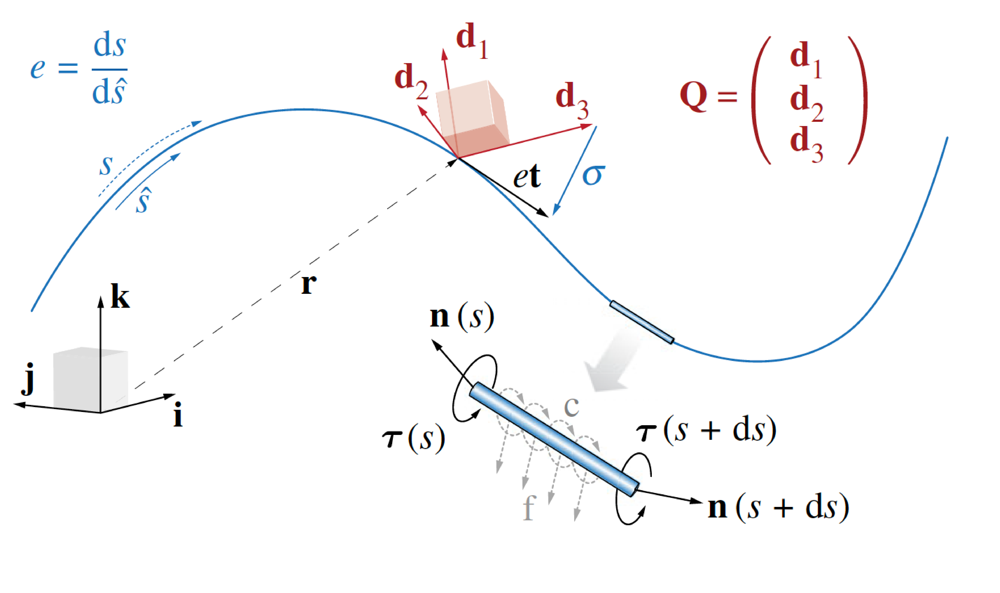
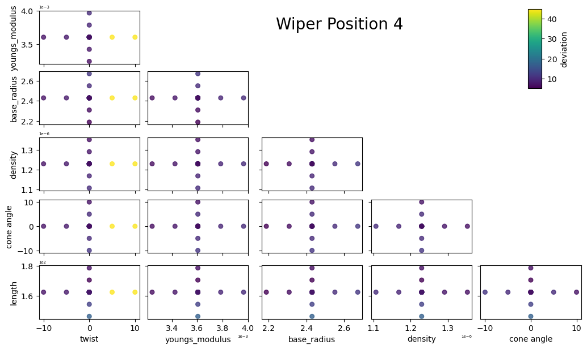
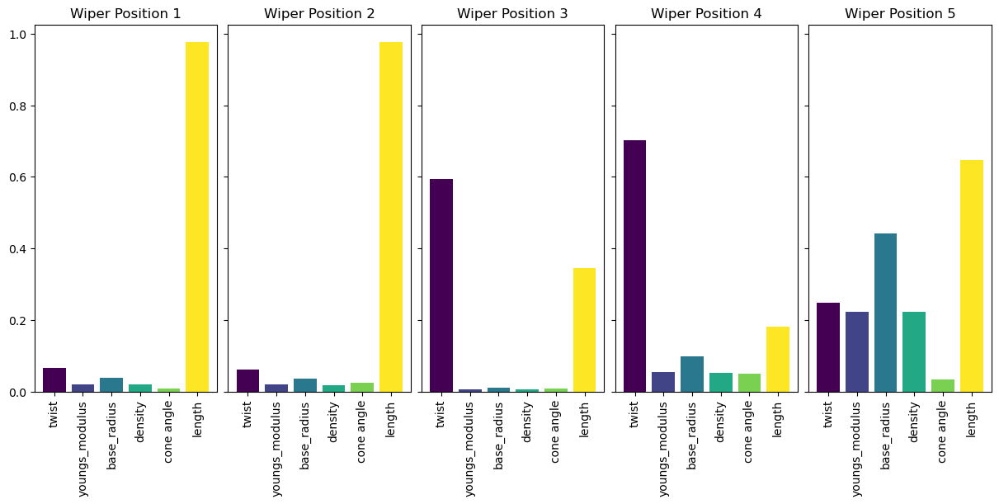
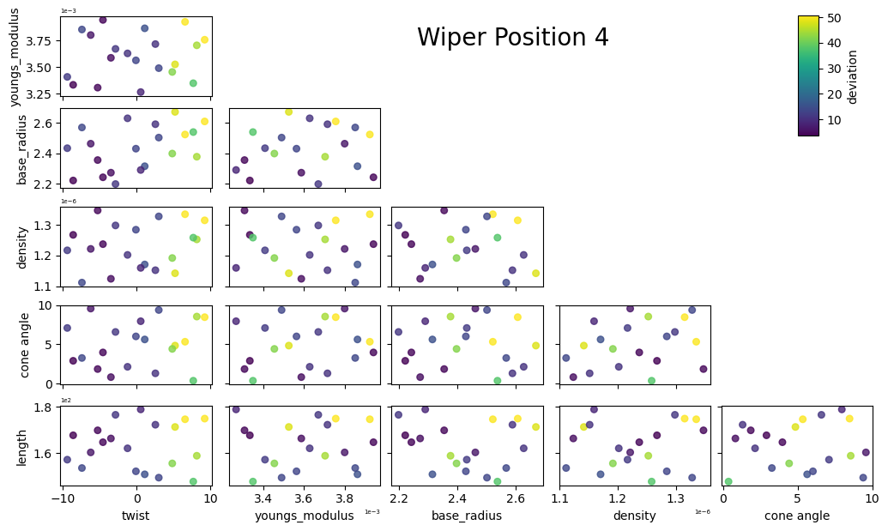
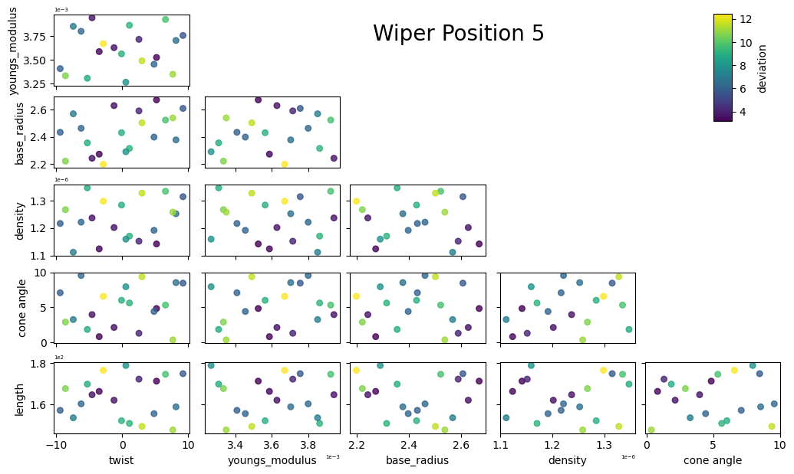
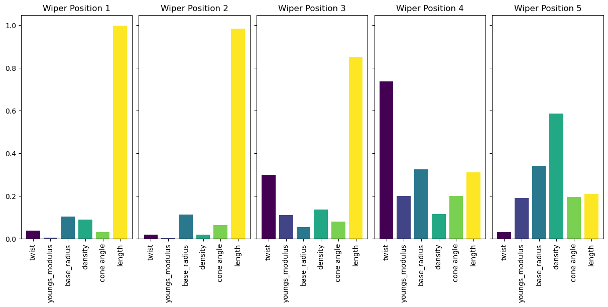

# {.center}

<div style="text-align:center;">

<div style="font-size: 1.8em; font-weight: 600;">
Proposal of Shape Prediction of Wiper Hose Geometry<br>
for Valeo Pvt. Ltd., Chennai, IN
</div>

<br/>

<div style="font-size: 1.1em; font-weight: 500;">
Project Coordinators
</div>

<div style="font-size: 0.95em; margin-top: 0.5em;">
Prof. G. Saravana Kumar, IIT Madras<br>
Prof. D. Davidson Jebaseelan, VIT Chennai
</div>

</div>

## Problem Statement

 - Determining [the equilibrium geometry of flexible automotive wiper hoses]{style="color:red;"} under specified routing constraints remains a key challenge in product design.

 - [A computational mechanics-based framework]{style="color:red;"} is needed to accurately evaluate hose geometry, enabling improved packaging validation.

## Basic Hermite Spline

 - We have End points ($p_0$, $p_1$), End vectors ($v_0$, $v_1$)

 - Cubic Spline is a natural choice to construct a curve

$$
\begin{aligned}
p_t
&=
(2t^3-3t^2+1)p_0 \\
&\quad + (t^3-2t^2+t)v_0 \\
&\quad + (-2t^3+3t^2)p_1 \\
&\quad + (t^3-t^2)v_1,
\qquad 0 \le t \le 1.
\end{aligned}
$$

## Basic Hermite Spline - Output

{fig-align="center"}

## Arc Length Constrained Hermite {.smaller}

:::: {.columns}

::: {.column width="60%"}

$$
\min_x \; f(x)
=
L\!\left(
\operatorname{Hermite}
\left(
p_0,\,
p_1,\,
x\,u_0,\,
x\,u_1
\right)
\right)
-
L(\text{Prototype})
$$

where

$$
\begin{aligned}
L(\cdot) &:\ \text{Length function},\\
p_0 &:\ \text{Starting point},\\
p_1 &:\ \text{Ending point},\\
u_0 &:\ \text{Unit tangent at } p_0,\\
u_1 &:\ \text{Unit tangent at } p_1,\\
x &:\ \text{Magnitude applied to } u_0 \text{ and } u_1 \\
  &\ \text{ (optimization variable)}.
\end{aligned}
$$

- [Link for all cases](https://pranavduraisamy.github.io/spline-valeo/ppt/1411-arc-len-herm){style="color:blue;"}

:::

::: {.column width="40%"}

{.absolute top="21%" left="63%" width="300"}

:::

::::

## Cosserat Rod Theory {.smaller}

:::: {.columns}

::: {.column width="50%"}

- Models a slender structure as a deformable centerline with an attached local reference frame (directors)

- Captures all deformation modes: [Bending, Twisting, Stretching, Shearing]{style="color:red;"}

- Each cross-section possesses [6 DOF: 3T+3R]{style="color:red;"}

- Equilibrium configuration is obtained by [satisfying conservation of linear and angular momentum along the rod]{style="color:red;"}

- [Link for all cases - Prototype](https://pranavduraisamy.github.io/spline-valeo/ppt/1411-pyelastica-basic){style="color:blue;"}

- [Link for all cases - Wiper](https://pranavduraisamy.github.io/spline-valeo/ppt/2101-wiper-data){style="color:blue;"}

- [Link for PyElastica Docs and Theory](https://www.cosseratrods.org/cosserat_rods/theory/){style="color:blue;"}


:::

::: {.column width="50%"}

<br/>

<br/>



:::

::::

## Cosserat Rod Theory {.smaller}

**Conservation of Linear Momentum:** 

$$
\small{\rho A \cdot \partial_t^2 \bar{\mathbf{r}} = \overbrace{\partial_s \left( \frac{\mathbf{Q}^T \mathbf{S} \boldsymbol{\sigma}}{e} \right)}^{\substack{\text{internal shear/} \\ \text{stretch force}}} + \overbrace{e \ \bar{\mathbf{f}}}^{\substack{\text{external} \\ \text{force}}} }
$$

**Conservation of Angular Momentum:** 

$$
\small{\begin{align}\frac{\rho \mathbf{I}}{e} \cdot \partial_t \boldsymbol{\omega}&=\overbrace{\partial_s \left( \frac{\mathbf{B} \boldsymbol{\kappa}}{e^3} \right) + \frac{\boldsymbol{\kappa} \times \mathbf{B} \boldsymbol{\kappa}}{e^3}}^{\text{internal bend/twist couple}}+\overbrace{\left( \mathbf{Q}\frac{\bar{\mathbf{r}}_s}{e} \times \mathbf{S} \boldsymbol{\sigma} \right)}^{\substack{\text{internal shear/} \\ \text{stretch couple}}}+\overbrace{\left( \rho \mathbf{I} \cdot \frac{\boldsymbol{\omega}}{e} \right) \times \boldsymbol{\omega}}^{\text{Lagrangian transport}}+\overbrace{\frac{\rho \mathbf{I} \boldsymbol{\omega}}{e^2} \cdot \partial_t e}^{\text{unsteady dilation}}+\overbrace{e \ \mathbf{c}}^{\substack{\text{external} \\ \text{couple}}}
\end{align}}
$$

By solving these equations with suitable boundary conditions, we can model the dynamics of a single Cosserat elastic rod.

::: aside
M. Tummers, et. al., "Cosserat Rod Modeling of Continuum Robots from Newtonian and Lagrangian Perspectives," in IEEE Transactions on Robotics, vol. 39, no. 3, pp. 2360-2378, June 2023, doi: 10.1109/TRO.2023.3238171.
:::

## Properties

Density = 1.230 g/cm^3^ (Assuming as Natural Rubber)

Young's Modulus = 3.605 MPa

Shear Modulus = 1.209 MPa

Poisson's Ratio = 0.49

Radius = 2.43 mm (Assuming Equivalent Mass)

No. of Elements = 100

## PyElastica - Prototype {.r-stretch}

:::: {.columns}
::: {.column width="58%"}

:::
::: {.column width="42%"}

:::
::::

## PyElastica - Wiper {.r-stretch}

:::: {.columns}
::: {.column width="58%"}

:::
::: {.column width="42%"}

:::
::::

## PyElastica - OFAT Analysis {.smaller}

 - Varies [one input parameter]{style="color:red;"} at a time, keeping all others constant

 - Used to study sensitivity of outputs to individual factors

 - Helps [identify dominant variables]{style="color:red;"} influencing system response

 - Useful for [initial screening of parameters before advanced methods]{style="color:red;"}

 - [Computationally cheaper]{style="color:red;"} but may miss interaction behavior in complex systems

 - [Link for all cases - Prototype](https://pranavduraisamy.github.io/spline-valeo/ppt/2411-ofat-sens){style="color:blue;"}

 - [Link for all cases - Wiper](https://pranavduraisamy.github.io/spline-valeo/ppt/2405-wiper-ofat){style="color:blue;"}

## Design Space for OFAT {.smaller}

| Parameter | -10% | -05% | +00% | +05% | +10% |
|---|---|---|---|---|---|
| Density g/cm^3^ | 1.107 | 1.167 | 1.23 | 1.292 | 1.353 |
| Young's Modulus MPa | 3.24 | 3.424 | 3.605 | 3.785 | 3.96 |0
| Radius mm | 2.187 | 2.309 | 2.43 | 2.551 | 2.673 |
| Twist deg | -10 | -5 | 0 | 5 | 10 |
| Cone Angle deg | -10 | -5 | 0 | 5 | 10 |
| Length mm | 146.98 | 155.15 | 163.32 | 171.49 | 179.65 |

## PyElastica - OFAT - Prototype



## PyElastica - OFAT - Wiper

:::: {.columns}
::: {.column width="58%"}

:::
::: {.column width="42%"}

:::
::::

## PyElastica - OFAT - Pairplot



## PyElastica - OFAT - Sensitivity



## PyElastica - DoE Study {.smaller}

 - Design of Experiments (DOE) used for systematic exploration of parameter space

 - Ensures efficient sampling across all input variables simultaneously

 - [Latin Hypercube Sampling (LHS)]{style="color:red;"} divides each variable range into equal probability intervals

 - One sample is drawn from each interval → ensures better space-filling than random sampling

 - [Captures global trends and interactions]{style="color:red;"} with fewer simulations

 - Reduces computational cost compared to full factorial design

 - [Link for all cases - Prototype](https://pranavduraisamy.github.io/spline-valeo/ppt/2204-doe-full-10p){style="color:blue;"}

 - [Link for all cases - Wiper](https://pranavduraisamy.github.io/spline-valeo/ppt/3004-wiper-doe){style="color:blue;"}

## Design Space for DoE {.smaller}

Density (1.23) = 1.107 to 1.353 g/cm^3^ 

Young's Modulus (3.605) = 3.24 to 3.96 MPa

Radius (2.43) = 2.187 to 2.673 mm

Twist in End Vector (0) = -10° to 10°

Cone Angle (0) = 0° to 10°

Length (163.32) = 146.98 to 179.65 mm

Sampled using LHS

## PyElastica - DoE - Prototype

:::: {.columns}
::: {.column width="58%"}

:::
::: {.column width="42%"}

:::
::::

## PyElastica - DoE - Wiper

:::: {.columns}
::: {.column width="58%"}

:::
::: {.column width="42%"}

:::
::::

## PyElastica - DoE - Pairplot



## PyElastica - DoE - Sensitivity


## Hollow Cross-Section Adaptation in PyElastica {.smaller}

- PyElastica natively supports only [solid circular rods]{style="color:red;"}

- A solid rod is first initialized and then re-parameterized as a [hollow tube]{style="color:red;"}

- Cross-sectional properties are recomputed analytically 

- Stiffness matrices are overwritten  
  - Shear stiffness updated using hollow cross-sectional area  
  - Bending stiffness updated using second moments of inertia  

- Mass and inertia tensors are redefined  
  - Element-wise mass computed from hollow volume  
  - Rotational inertia updated for annular geometry  

- Enables a [hollow hose representation without modifying the core solver]{style="color:red;"}

## Hollow Cross-Section Adaptation in PyElastica - Links

 - [Link for all cases - Prototype and Wiper](https://pranavduraisamy.github.io/spline-valeo/ppt/1506-mod-overwrite){style="color:blue;"}

 - [Link for all cases - DoE - Prototype](https://pranavduraisamy.github.io/spline-valeo/ppt/2106-doe-full-10p-mod){style="color:blue;"}

 - [Link for all cases - DoE - Wiper](https://pranavduraisamy.github.io/spline-valeo/ppt/2106-wiper-doe-mod){style="color:blue;"}


## PyElastica (Hollow) - Prototype {.r-stretch}

:::: {.columns}
::: {.column width="58%"}

:::
::: {.column width="42%"}

:::
::::

## PyElastica (Hollow) - Wiper {.r-stretch}

:::: {.columns}
::: {.column width="58%"}

:::
::: {.column width="42%"}

:::
::::

## PyElastica (Hollow) - DoE - Prototype

:::: {.columns}
::: {.column width="58%"}

:::
::: {.column width="42%"}

:::
::::

## PyElastica (Hollow) - DoE - Wiper

:::: {.columns}
::: {.column width="58%"}

:::
::: {.column width="42%"}

:::
::::

## PyElastica (Hollow) - DoE - Pairplot



## PyElastica (Hollow) - DoE - Sensitivity



## Executing the Code {.smaller}

 1. [Fork/Clone/Download](https://www.geeksforgeeks.org/git/difference-between-fork-and-clone-in-github/){style="color:blue;"} this [repository](https://github.com/pranavduraisamy/spline-valeo){style="color:blue;"}

 1. Install [pixi](https://pixi.prefix.dev/latest/installation/){style="color:blue;"} (Optional but better to have)

 1. If the above step is skipped, Refer to the downloaded pixi.toml file to install the packages manually by yourself, Also the following steps are valid only if you have pixi. 

 1. Open terminal and Navigate to the downloaded folder.
 
 1. For Jupyterlab, Run `pixi run jupyter`

 1. For VS Code, Run `pixi install` and Now you can use any code directly in VS Code (Select the kernel spline-valeo if it asks)

 1. Pixi will automatically handle all package installations, This will help to avoid all version and package mismatch you faced before. 

## PyElastica Code {.smaller}

::: {.callout}

All the codes in the repo follows a similar structure as below. Sometimes this is wrapped inside a function for DoE/OFAT studies along with a code snippet for parallel processing.

:::


```python

# Import Dependencies

import numpy as np
import pandas as pd
import utils
import matplotlib.pyplot as plt
import matplotlib.animation as manimation
import plotly.graph_objects as go
import plotly.io as pio
from typing import Callable, Any
from scipy.spatial.transform import Rotation, Slerp
from elastica.modules import (
    BaseSystemCollection,
    Constraints,
    Forcing,
    Damping,
    CallBacks,
)
from elastica.rod.cosserat_rod import CosseratRod
from elastica.boundary_conditions import OneEndFixedBC, ConstraintBase
from elastica.external_forces import GravityForces
from elastica.dissipation import AnalyticalLinearDamper
from elastica.callback_functions import CallBackBaseClass, defaultdict
from elastica.timestepper.symplectic_steppers import PositionVerlet
from elastica.timestepper import integrate

# Initiate Simulator Class

class Simulator(BaseSystemCollection, Constraints, Forcing, Damping, CallBacks):
    pass

# Import prototype's excel/csv file to read end points and vectors, Define Constants

df = pd.read_csv("../data/2810/p1-case1.csv")
pts = df.iloc[10:, 2:].reset_index(drop=True)
length = utils.length(pts.values)

simulator = Simulator()
n_elements = 99
base_length = length
base_radius = 2.43
start_pos = df.iloc[5, 2:].values.astype(float)
direction = np.array([0.0, 1.0, 0.0])
normal = np.array([0.0, 0.0, 1.0])
density = 1.23e-6
youngs_modulus = 0.003605
shear_modulus = youngs_modulus / (2.0 * (1.0 + 0.49))

# Create Straight Rod

tube = CosseratRod.straight_rod(
    n_elements=n_elements,
    start=start_pos,
    direction=direction,
    normal=normal,
    base_length=base_length,
    base_radius=base_radius,
    density=density,
    youngs_modulus=youngs_modulus,
    shear_modulus=shear_modulus,
)

simulator.append(tube)

# Adding Gravity

simulator.add_forcing_to(tube).using(
    GravityForces, acc_gravity=np.array([0.0, 0.0, -9.81e-3])
)

# Adding Dampner

dmp_const = 0.3
dt = 1e-3
simulator.dampen(tube).using(
    AnalyticalLinearDamper, damping_constant=dmp_const, time_step=dt
)
print("Added dampner to the simulation")

# Constraining P0 in all dofs

simulator.constrain(tube).using(
    OneEndFixedBC, constrained_position_idx=(0,), constrained_director_idx=(0,)
)
print("Added FixedBC")

# Forcing the other end P1 to follow a prescribed trajectory

class EndpointKinematicConstraint(ConstraintBase):
    def __init__(
        self,
        node_idx: int,
        elem_idx: int,
        target_position_function: Callable[[float], np.ndarray],
        target_director_function: Callable[[float], np.ndarray],
        target_velocity_function: Callable[[float], np.ndarray],
        target_omega_function: Callable[[float], np.ndarray],
        **kwargs
    ):
        super().__init__(**kwargs)
        self.node_idx = node_idx
        self.elem_idx = elem_idx
        self.pos_func = target_position_function
        self.dir_func = target_director_function
        self.vel_func = target_velocity_function
        self.omg_func = target_omega_function

    def constrain_values(self, system: Any, time: float) -> None:
        target_pos = self.pos_func(time)
        target_dir = self.dir_func(time)
        system.position_collection[..., self.node_idx] = target_pos
        system.director_collection[..., self.elem_idx] = target_dir

    def constrain_rates(self, system: Any, time: float) -> None:
        target_vel = self.vel_func(time)
        target_omg = self.omg_func(time)
        system.velocity_collection[..., self.node_idx] = target_vel
        system.omega_collection[..., self.elem_idx] = target_omg

# Classes for trajectory interpolation

class TrajectoryRamp:
    def __init__(
        self,
        start_pos: np.ndarray,
        end_pos: np.ndarray,
        start_dir: np.ndarray,
        end_dir: np.ndarray,
        ramp_time: float,
    ):

        self.start_pos = start_pos
        self.end_pos = end_pos
        self.pos_diff = end_pos - start_pos
        self.ramp_time = ramp_time
        self.const_vel = self.pos_diff / ramp_time
        key_rots = Rotation.from_matrix([start_dir, end_dir])
        key_times = [0, ramp_time]
        self.slerp = Slerp(key_times, key_rots)
        self.const_omg = np.zeros((3,))

    def _get_ramp_factor(self, time: float) -> float:
        if time < 0:
            return 0.0
        elif time > self.ramp_time:
            return 1.0
        else:
            return time / self.ramp_time

    def get_position(self, time: float) -> np.ndarray:
        factor = self._get_ramp_factor(time)
        return self.start_pos + self.pos_diff * factor

    def get_director(self, time: float) -> np.ndarray:
        clamped_time = max(0, min(time, self.ramp_time))
        return self.slerp(clamped_time).as_matrix()

    def get_velocity(self, time: float) -> np.ndarray:
        if 0 < time <= self.ramp_time:
            return self.const_vel
        else:
            return np.zeros((3,))

    def get_omega(self, time: float) -> np.ndarray:
        if 0 < time <= self.ramp_time:
            return self.const_omg
        else:
            return np.zeros((3,))


class TrajectoryCircle:
    def __init__(self, center: np.ndarray, radius: float, freq: float):
        self.center = center
        self.radius = radius
        self.omega_val = 2.0 * np.pi * freq

    def get_position(self, time: float) -> np.ndarray:
        x = self.center + self.radius * np.cos(self.omega_val * time)
        y = self.center + self.radius * np.sin(self.omega_val * time)
        return np.array([x, y, self.center])

    def get_velocity(self, time: float) -> np.ndarray:
        vx = -self.radius * self.omega_val * np.sin(self.omega_val * time)
        vy = self.radius * self.omega_val * np.cos(self.omega_val * time)
        return np.array([vx, vy, 0.0])

    def get_director(self, time: float) -> np.ndarray:
        return np.identity(3)

    def get_omega(self, time: float) -> np.ndarray:
        return np.zeros((3,))

# Defining target position and directors

init_pos = tube.position_collection[..., -1].copy()
init_dir = tube.director_collection[..., -1].copy()
tgt_pos = df.iloc[6, 2:].values
tgt_dir = utils.dir_unitvectr(df.iloc[9, 2:].values).T
ramp_time = 350

trajectory = TrajectoryRamp(init_pos, tgt_pos, init_dir, tgt_dir, ramp_time)

simulator.constrain(tube).using(
    EndpointKinematicConstraint,
    node_idx=-1,
    elem_idx=-1,
    target_position_function=trajectory.get_position,
    target_director_function=trajectory.get_director,
    target_velocity_function=trajectory.get_velocity,
    target_omega_function=trajectory.get_omega,
)

# Callback for storing simulation history

class TubeCallback(CallBackBaseClass):
    def __init__(self, step_skip: int, callback_params: dict):
        CallBackBaseClass.__init__(self)
        self.every = step_skip
        self.callback_params = callback_params

    def make_callback(self, system: Any, time: int, current_step: int):
        if current_step % self.every == 0:
            self.callback_params["time"].append(time)
            self.callback_params["step"].append(current_step)
            self.callback_params["position"].append(system.position_collection.copy())
            self.callback_params["directors"].append(system.director_collection.copy())
            self.callback_params["length"].append(system.rest_lengths.copy())
            self.callback_params["radius"].append(system.radius.copy())
            self.callback_params["velocity"].append(system.velocity_collection.copy())
            self.callback_params["avg_velocity"].append(
                system.compute_velocity_center_of_mass()
            )
            self.callback_params["com"].append(system.compute_position_center_of_mass())
            self.callback_params["curvature"].append(system.kappa.copy())
            return


cb_data = defaultdict(list)
dt_intrvl = 100
simulator.collect_diagnostics(tube).using(
    TubeCallback, step_skip=dt_intrvl, callback_params=cb_data
)

# Finalizing Simulation

simulator.finalize()
print("Simulator finalized")

# Solving

timestepper = PositionVerlet()
final_time = 750
total_steps = int(final_time / dt)

print("Running simulation...")
integrate(timestepper, simulator, final_time, total_steps)
print("Simulation finished.")

# Plotting the output and comparing with the prototype - Interactive 

df = pd.read_csv("../data/2810/p1-case1.csv")
prt = df.iloc[10:, 2:].reset_index(drop=True)
p0 = df.iloc[5, 2:].values.astype(float)
p1 = df.iloc[6, 2:].values.astype(float)
u0 = df.iloc[8, 2:].values.astype(float) * df.iloc[2, 1]
u1 = df.iloc[9, 2:].values.astype(float) * df.iloc[3, 1]
siml = pd.DataFrame(final_rod_position.T, columns=["X", "Y", "Z"])
fig = utils.plotter(
    prt.values,
    p0,
    p1,
    u0,
    u1,
    x_label="Prototype",
    spl1=siml.values,
    spl1_label="Simulated",
    cne=6,
    intr="d",
)
a = df.iloc[59, 2:]
b = siml.iloc[50]
fig.add_trace(
    go.Scatter3d(
        x=[a[0], b[0]],
        y=[a[1], b[1]],
        z=[a[2], b[2]],
        mode="lines",
        name="Error",
        line=dict(color="red", width=6, dash="longdash"),
    )
)
fig.show()
pio.write_html(fig, "html/p1-case1.html")

# Saving the final position of nodes to a csv file

siml.to_csv("data/p1-case1.csv", index=False)

# Plotting the output and comparing with the prototype - Static

fig, ax1, ax2, ax3, ax4 = utils.plotter(
    prt.values,
    p0,
    p1,
    u0,
    u1,
    x_label="Prototype",
    spl1=siml.values,
    spl1_label="Simulated",
    cne=6,
    intr="s",
)
ax4.plot([a[0], b[0]], [a[1], b[1]], [a[2], b[2]], label="Error", linestyle="--")
ax4.legend()
fig.show()

```

## Summary {.smaller}

 - Built a [robust standalone python framework]{style="color:red;"} to compute the equilibrium geometry of flexible automotive wiper hose under specified routing conditions.

 - The simulated shape of the hose exhibits [good visual agreement]{style="color:red;"} with the prototype geometry for all the cases (incl. wiper cases).

 - Across all 12 prototype cases, 
    - Computed geometries achieved an average midpoint deviation of [15.3 mm]{style="color:red;"}.
    - Best-performing case exhibited a deviation of [7.3 mm]{style="color:red;"}.

 - Across all 5 wiper cases, 
    - Computed geometries achieved an average midpoint deviation of [23.6 mm]{style="color:red;"}.
    - Best-performing case exhibited a deviation of [9.4 mm]{style="color:red;"}.
 
 - There are some common general assumptions like
    - Material property is [uniform and constant]{style="color:red;"} through out the hose,
    - There is [no twist involved along the hose and no explicit residual stress/strain]{style="color:red;"}.

## Summary - OFAT {.smaller}

 - The observed error is attributed to multiple factors, including [unintended twisting or stress may be induced during assembly, non-uniform material properties, and manufacturing-induced curvature]{style="color:red;"}.

 - To further investigate the sources of error, OFAT and DoE studies were conducted.

 - OFAT Analysis revealed,
    - The sensitivity of the computed geometry varies significantly across the wiper positions. 
    - Wiper Positions [1 and 2]{style="color:red;"} is overwhelmingly dominated by [hose length]{style="color:red;"}.
    - Wiper Positions [3 and 4]{style="color:red;"} are primarily influenced by [twist]{style="color:red;"}.
    - Indicates that [the governing parameters change with the boundary configuration]{style="color:red;"}.

## Summary - DoE {.smaller}

 - DoE Analysis revealed,
    - [Hose length is the dominant contributor]{style="color:red;"} to geometric variability across most wiper positions.
    - [Twist and base radius]{style="color:red;"} become increasingly influential at Wiper Positions 4 and 5.
    - Parameter interactions amplify the effects of base radius and cone angle compared to OFAT results.
    - Material properties have a comparatively minor influence.

## Summary - Hollow Cross-Section Adaptation {.smaller}

 - For all four positions in Prototype Case 1, the deviation increases along the hose length when compared to the initial simulations.
 - Prototype [Cases 2 and 3 exhibit a significant reduction in deviation]{style="color:red;"} across the hose.
 - The wiper cases exhibit comparatively larger deviations, with an overall increasing trend in the deviation distribution.
 - DoE Analysis revealed,
    - Length continues to dominate the response at early wiper positions.
    - Sensitivity shifts toward [twist and density at later wiper positions]{style="color:red;"}.
    - Unlike the solid-tube formulation, the hollow-tube model shows [increased influence of inertial parameters]{style="color:red;"}.

# Thank you!