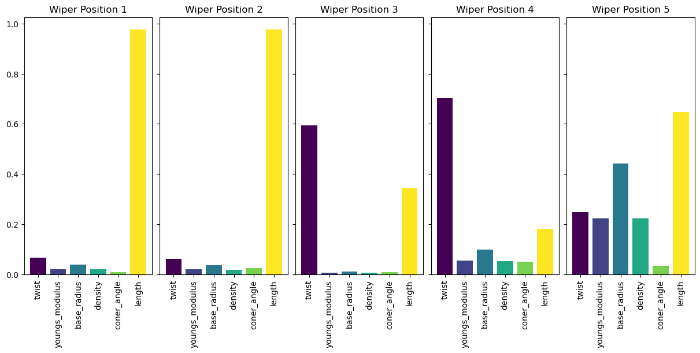

# OFAT Study - Wiper cases - 10% Bounds

## Design Space for OFAT

| Parameter | -10% | -05% | +00% | +05% | +10% |
|---|---|---|---|---|---|
| Density g/cm^3^ | 1.107 | 1.167 | 1.23 | 1.292 | 1.353 |
| Young's Modulus MPa | 3.24 | 3.424 | 3.605 | 3.785 | 3.96 |
| Radius mm | 2.187 | 2.309 | 2.43 | 2.551 | 2.673 |
| Twist deg | -10 | -5 | 0 | 5 | 10 |
| Coner Angle deg | -10 | -5 | 0 | 5 | 10 |
| Length mm | 146.98 | 155.15 | 163.32 | 171.49 | 179.65 |

Sampled using LHS

## Wiper Position 1 {.r-stretch}
:::: {.columns}
::: {.column width="58%"}

:::
::: {.column width="42%"}

:::
::::

## Pairplot - 1 {auto-stretch="true"}



## Wiper Position 2 {.r-stretch}
:::: {.columns}
::: {.column width="58%"}

:::
::: {.column width="42%"}

:::
::::

## Pairplot - 2 {.r-stretch}



## Wiper Position 3 {.r-stretch}
:::: {.columns}
::: {.column width="58%"}

:::
::: {.column width="42%"}

:::
::::

## Pairplot - 3 {.r-stretch}



## Wiper Position 4 {.r-stretch}
:::: {.columns}
::: {.column width="58%"}

:::
::: {.column width="42%"}

:::
::::

## Pairplot - 4 {.r-stretch}



## Wiper Position 5 {.r-stretch}
:::: {.columns}
::: {.column width="58%"}

:::
::: {.column width="42%"}

:::
::::

## Pairplot - 5 {.r-stretch}



## Sensitivity {.r-stretch}

