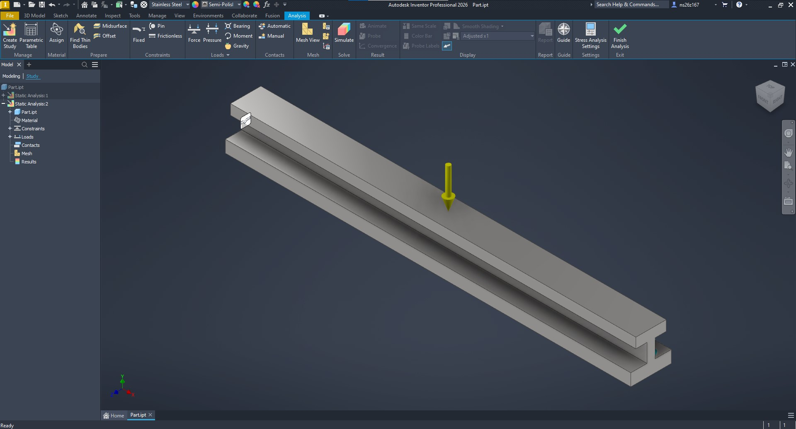
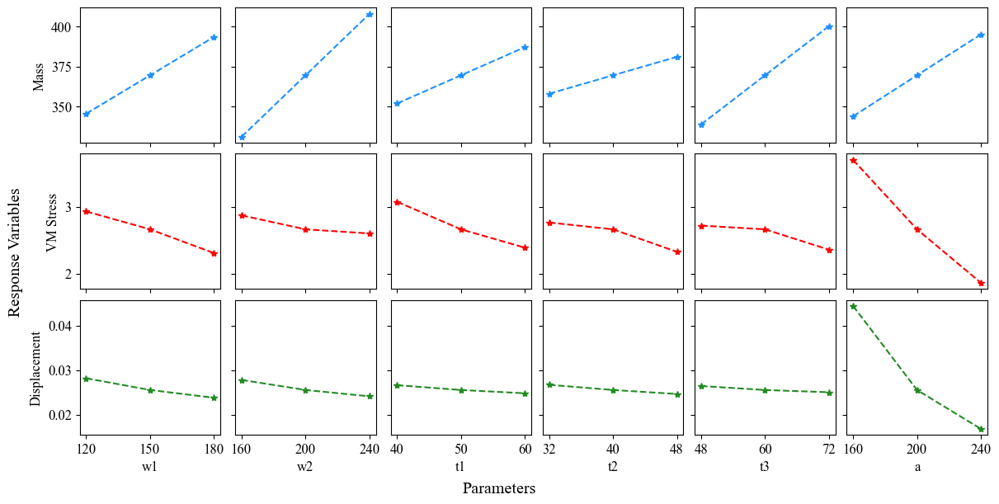
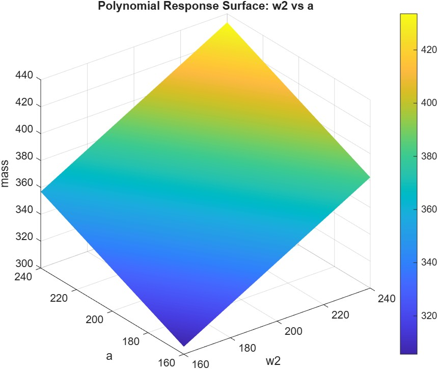
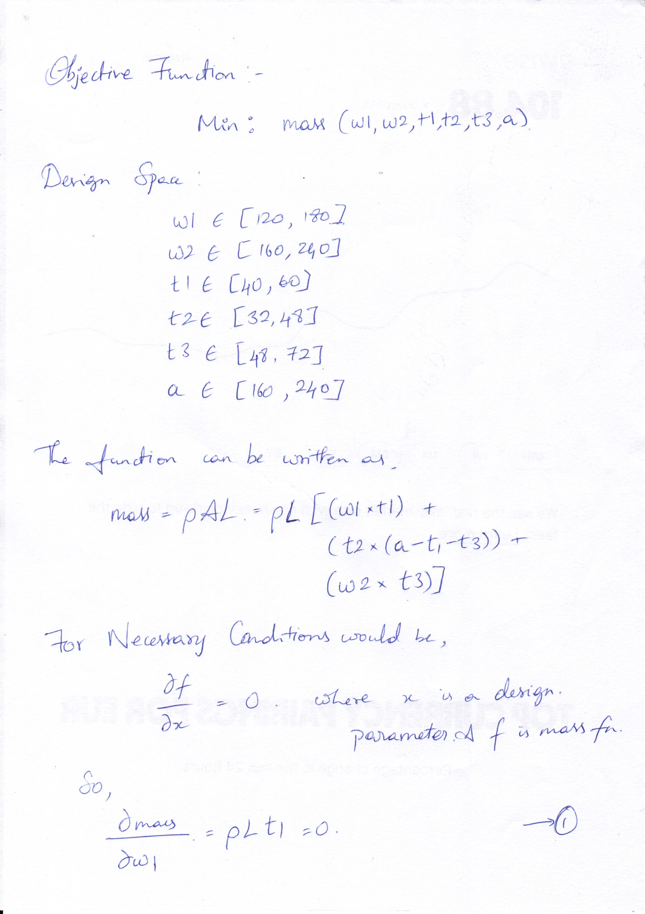
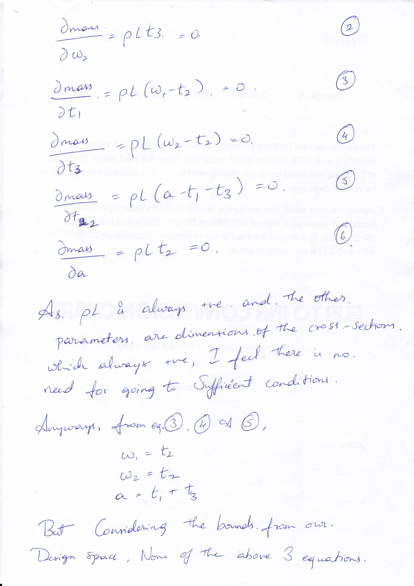
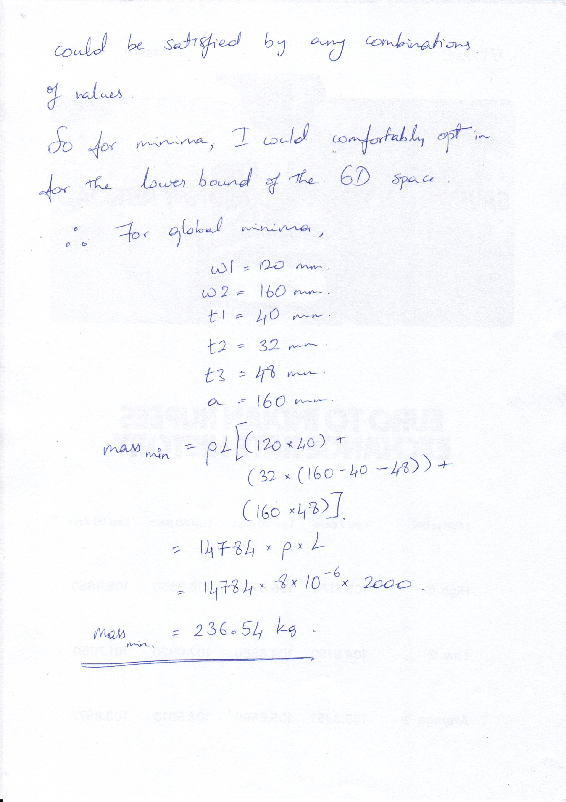

<br>

<br>

<center> 

::: {style="font-size: 1.75em;"}
**ED 6002: Optimization Methods in Engineering Design (2025-26)**
:::

::: {style="font-size: 1.25em;"}
*Assignment 1 | Pranav D | ns26z167*
:::

</center>

## At a Glance

:::: columns
::: { .column width="50%" style="font-size: 1em;"}

 - Created a 2m beam with the specified I cross section
 - Applied 9810 N load on the top face
 - Simulated for the exhaustive set of parameteric configurations
 - 3 levels ^ 6 parameters results in 729 models!

:::

::: {.column width="50%"}

<br>

<br>



:::

::::

## Q1. Sensitivity of each variable on outcomes

 - To analyse the senstivity of a each variable in the cross section dimension, I chose to go by OFAT *(One Factor at a Time)* approach.
 - Change one variable, keep everything else the same (base dimensions), and analyse the trends in outcomes.

## 

### Sensitivity plot



## Comments

 - Mass is directly proportional to all the parameters -- Greater the cross section, greater the mass.
 - Though Mass is sensitive to all the parameters, its strongly influenced by ***w2***.
 - VM stress decrease as size increases, with ***a*** contributing for significant reduction compared to others.
 - Similarly displacement also decreases with increase in cross section parameters, but again ***a*** have higher effect.

## Q2. Optima based on DoE {.smaller}

#### Objective Function:

$$
Minimize: Mass(p)
$$


#### Design Space:

$$
p \in [0.8 p_0, 1.2 p_0]\\
p \in {w1,w2,t1,t2,t3,a}\\
p_0 := \text{nominal value of }p
$$

#### Constraints:

$$
\delta(p) \le 2~\text{mm}, \quad \text{FOS}(p) \ge 1.5
$$

##

### Optima 

| Parameter | Value (mm) | Parameter | Value (mm) |
| --------- | ---------- | --------- | ---------- |
| w1        | 120        | t1        | 40         |
| w2        | 160        | t2        | 32         |
| a         | 160        | t3        | 48         |

$$
\begin{align}
\text{Mass} &= 236.54 \text{ kg}\\
\delta &= 0.058 \text{ mm} \\
\text{Max VM Stress} &= 5.1 \text{ MPa}\\
\end{align}
$$

## Q3. Polynomial response surface



## Code

```{.matlab}
data = readtable('master.csv');
X = data{:, {'w1','w2','t1','t2','t3','a'}};
y = data.mass;
tbl = data(:, {'w1','w2','t1','t2','t3','a','mass'});
model = fitlm(tbl, 'quadratic');
disp(model)
model.Rsquared
[w2Grid, aGrid] = meshgrid( ...
    linspace(min(data.w2), max(data.w2), 50), ...
    linspace(min(data.a),  max(data.a),  50));
w1 = mean(data.w1);
t1 = mean(data.t1);
t2 = mean(data.t2);
t3 = mean(data.t3);
gridTable = table( ...
    repmat(w1, numel(w2Grid), 1), ...
    w2Grid(:), ...
    repmat(t1, numel(w2Grid), 1), ...
    repmat(t2, numel(w2Grid), 1), ...
    repmat(t3, numel(w2Grid), 1), ...
    aGrid(:), ...
    'VariableNames', {'w1','w2','t1','t2','t3','a'});
massPred = predict(model, gridTable);
massSurface = reshape(massPred, size(w2Grid));
surf(w2Grid, aGrid, massSurface)
xlabel('w2')
ylabel('a')
zlabel('mass')
title('Polynomial Response Surface: w2 vs a')
colorbar
shading interp
```

## Q4. Optima using ***fmincon*** - Code

```{.matlab}
data = readtable('master.csv');
predictorNames = {'w1', 'w2', 't1', 't2', 't3', 'a'};
responseName   = 'mass';
tbl = data(:, [predictorNames, {responseName}]);
model = fitlm(tbl, 'quadratic');
fprintf('\n================ MODEL SUMMARY ================\n');
disp(model);
fprintf('R-squared: %.4f\n', model.Rsquared.Ordinary);
objFun = @(x) predict(model, array2table(x, 'VariableNames', predictorNames));
lb = [min(data.w1), min(data.w2), min(data.t1), ...
      min(data.t2), min(data.t3), min(data.a)];
ub = [max(data.w1), max(data.w2), max(data.t1), ...
      max(data.t2), max(data.t3), max(data.a)];
x0 = (lb + ub) / 2;
limit = (mean(data.t1) + mean(data.t2)) * 1.5;
nonlcon = @(x) deal(x(3) + x(4) - limit, []); 
options = optimoptions('fmincon', ...
    'Algorithm', 'sqp', ...
    'Display', 'iter', ...
    'MaxFunctionEvaluations', 5000, ...
    'ConstraintTolerance', 1e-9, ...
    'OptimalityTolerance', 1e-9, ...
    'StepTolerance', 1e-10);
[x_opt, fval_opt] = fmincon(objFun, x0, ...
                            [], [], ...     
                            [], [], ...     
                            lb, ub, ...     
                            nonlcon, ...    
                            options);
problem = createOptimProblem('fmincon', ...
    'objective', objFun, ...
    'x0', x0, ...
    'lb', lb, 'ub', ub, ...
    'nonlcon', nonlcon, ...
    'options', options);
ms = MultiStart('Display', 'off');
[x_global, fval_global] = run(ms, problem, 1);
fprintf('\n================ LOCAL OPTIMUM (fmincon) ================\n');
disp(array2table(x_opt, 'VariableNames', predictorNames));
fprintf('Minimum mass (local) = %.4f\n', fval_opt);
fprintf('\n================ GLOBAL OPTIMUM (MultiStart) ================\n');
disp(array2table(x_global, 'VariableNames', predictorNames));
fprintf('Minimum mass (global) = %.4f\n', fval_global);
```

## Q4. Optima using ***fmincon*** - Output

```{.md}
================ LOCAL OPTIMUM (fmincon) ================
    w1     w2     t1    t2    t3     a 
    ___    ___    __    __    __    ___

    120    160    40    32    48    160

Minimum mass (local) = 236.5440

================ GLOBAL OPTIMUM (MultiStart) ================
    w1     w2     t1    t2    t3     a 
    ___    ___    __    __    __    ___

    120    160    40    32    48    160

Minimum mass (global) = 236.5440
```

## Q5. Comparing the solutions {.smaller}

 - Both the approach (Inventor and MATLAB) came to a common point as minima (236.54 kg) with the same design parameter values
 - Inventor:
   - Used Exhaustive Search -- Exploring the entire design space within the constraints
   - Total of 729 function calls/simulations solved
 - MATLAB:
   - SQP(Sequential Quadratic Programming) was used -- At each point, it approximates mass as a quadratic function and finds best direction to move
   - Takes only 84 function calls
 - Though SQP takes only ~12% of computational power consumed by Inventor, there is a chance that for complex geometries, responses could be highly nonlinear and ends up in a local optima point
 - To tackle that, its better to run the SQP multiple times and check convergence.

## Q6. Solving analytically

:::: columns

::: {.column width="33%"}



:::

::: {.column width="33%"}



:::

::: {.column width="33%"}



:::

::::