 

 

 

 

::: {style="font-size: 1.75em;"}
**Lab Talk - 06 Mar 26**
:::

::: {style="font-size: 1.25em;"}
*Pranav D | 3DIAM Lab*
:::

## Hypothesis Testing -- Frequentism

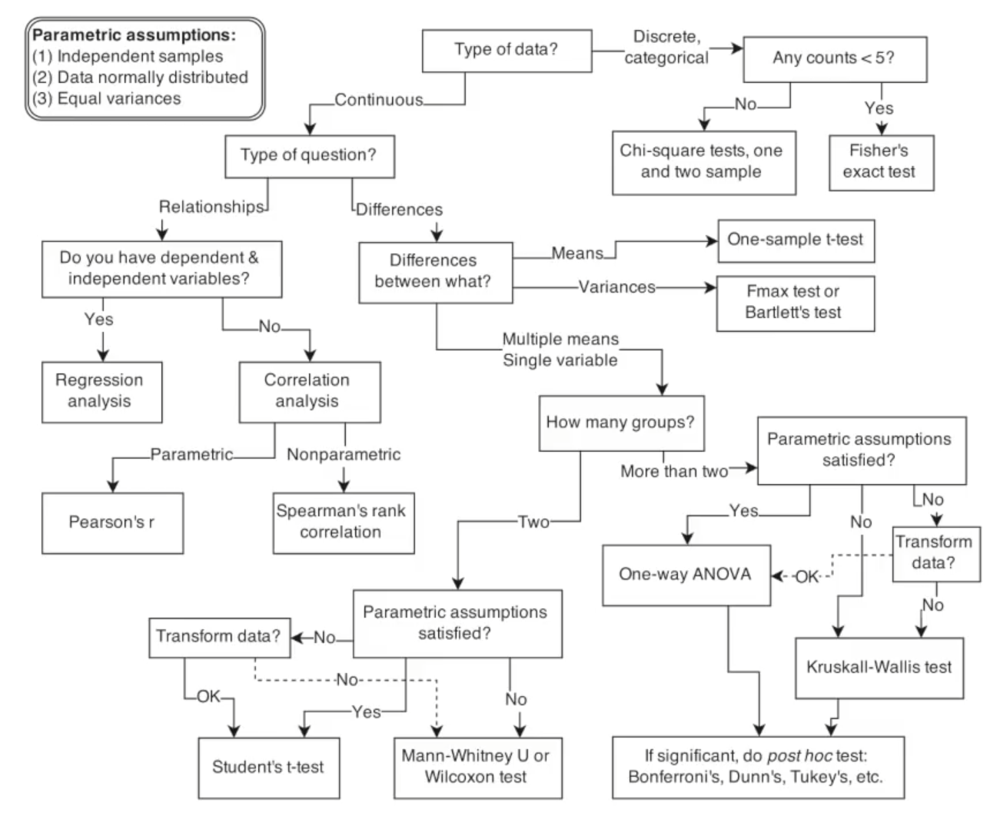{fig-align="center"}

## Bayesian Approach

 

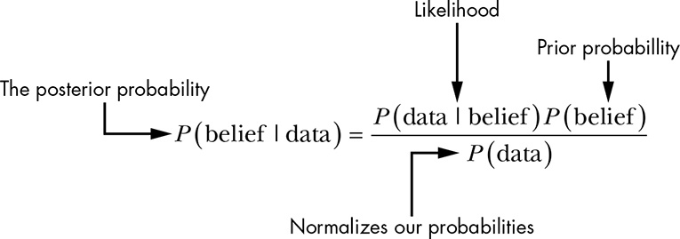{fig-align="center"}

## Concept behind Linear Regression

::: r-stack

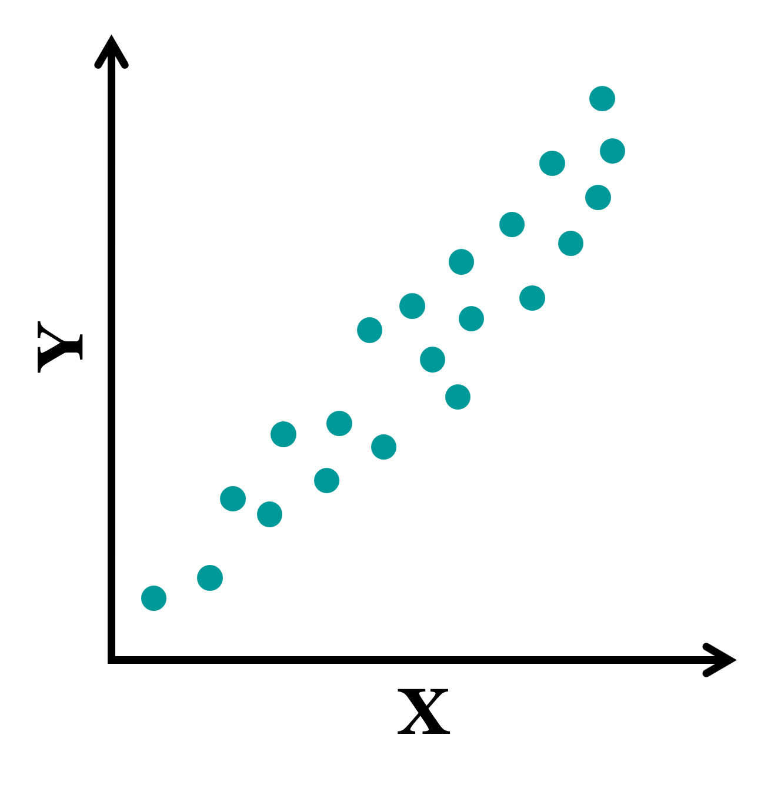{.fragment .fade-in-then-out .absolute height="500" top="18%" left="25%"}

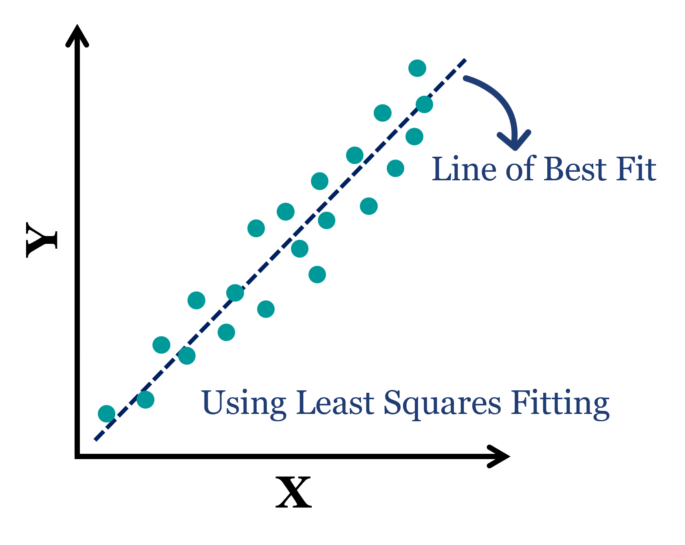{.fragment .fade-in-then-out .absolute height="500" top="18%" left="25%"}

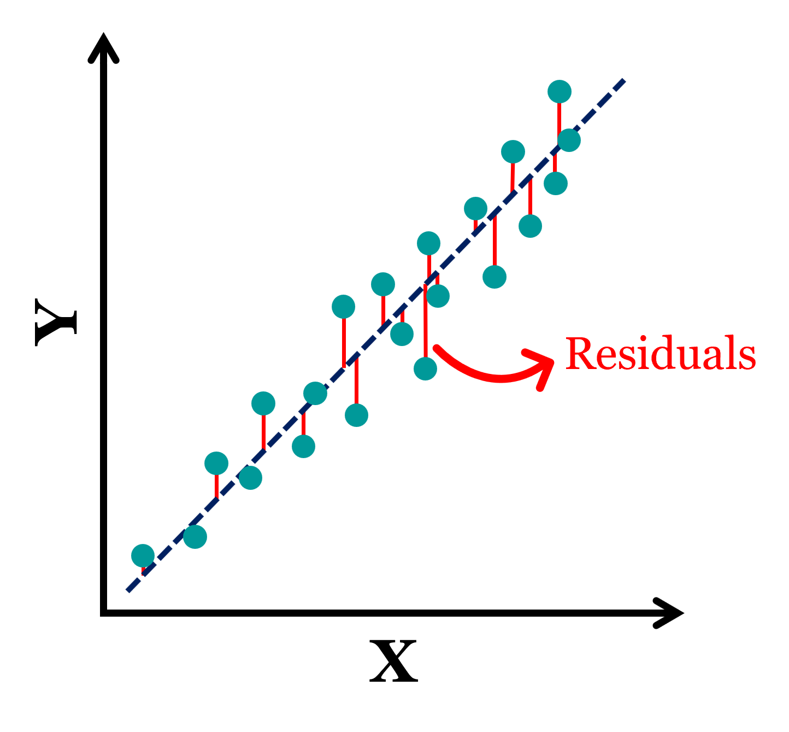{.fragment .fade-in .absolute height="500" top="18%" left="25%"}

:::

::: notes
This is the linear reg as we know it, there will be a set of points, we fit the line & the residuals would be normally distributed. behind the screen you would use MLE or least squares or smthng similar to minimise these residuals.
:::

## Classical vs Bayesian Regression

::::: columns

:::: {.column width="50%" style="font-size: 90%;" .fragment}

#### MLE Approach

\text{From Line of Best Fit,}
\begin{align}
Y &= \alpha + \beta X ± \sigma\\
 \\
\alpha &= \text{Constant (Intercept)}\\
\beta &= \text{Constant (Slope)}\\
\sigma &\sim \text{Normally distributed}
\end{align}

::::

:::: {.column width="50%" style="font-size: 90%;" .fragment}

#### Probabilistic Approach
\begin{align} 
Y &\sim \operatorname{N}(\mu,~\sigma)\\
\mu &= \alpha + \beta X\\
\alpha &\sim \text{A distribution}\\
\beta &\sim \text{Another distribution}\\
\sigma &\sim \text{Some other distribution}\\
\end{align}

::::

::: notes
From the line of best fit, you could find the parameters a & b as consts. another approach is to do bayesian linear reg. where these parameters are estimated as probability distributions
:::

:::::

## Bayesian Analysis - In a nutshell

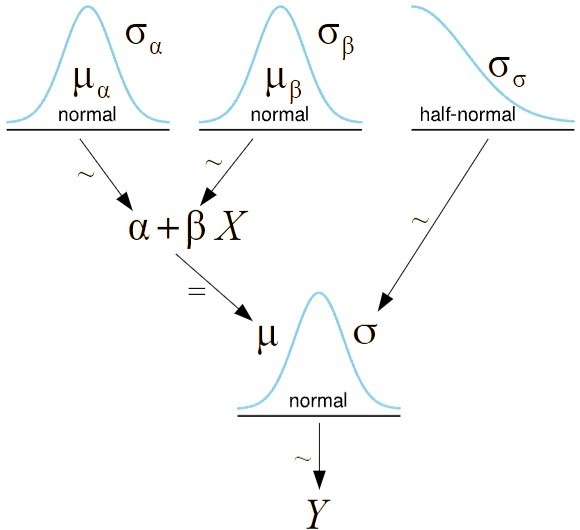{fig-align="center" height="450"}

::: aside 
Adapted from *Bayesian Analysis with Python by Oswaldo Martin*
:::

::: notes
As you can see here bayesian is other way around than a classical regression. all the relations are probabilistic than deterministic. every parameter whether it can be slope, intercept or even output variable is a probability distribution than singular values.
:::

# Cervical Segment Kinematics

## A Bit of Background...

::: r-stack

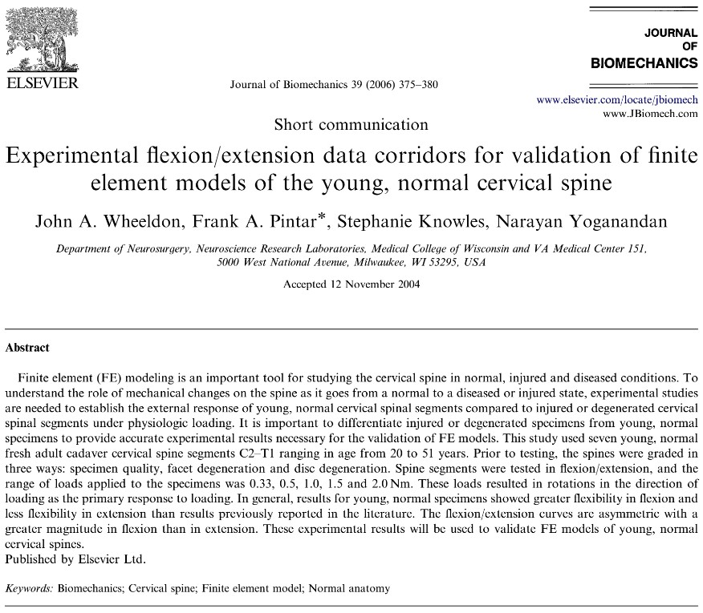{.fragment .absolute width="500" top="12%" left="15%"}

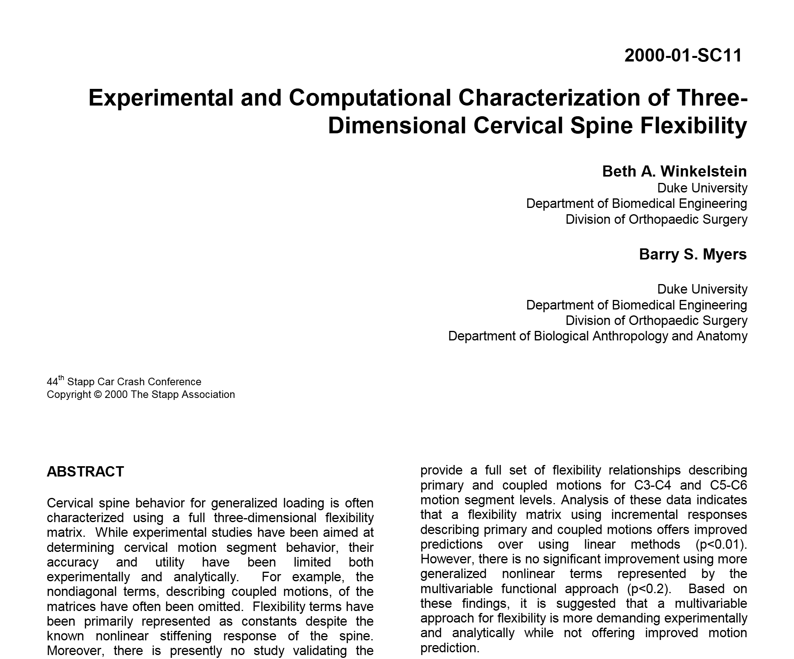{.fragment .absolute width="500" top="37%" left="27%"}

:::

::: notes
Let's take a look at some avl data that is related to this study. In some experiments, there were both male & female specimens but in the analysis everything was clubbed together. So we dunno the diff bw male & female. For example, this study by Wheeldon et al. Then we have this study by winkelstein et al but all the specimens in this study were male. 
:::

## A Bit of Background... {visibility="uncounted"}

::: r-stack

{.fragment .absolute  top="14%" left="1%" width="500" fragment-index=1}

{.fragment .absolute top="40%" left="5%" width="500" fragment-index=2}

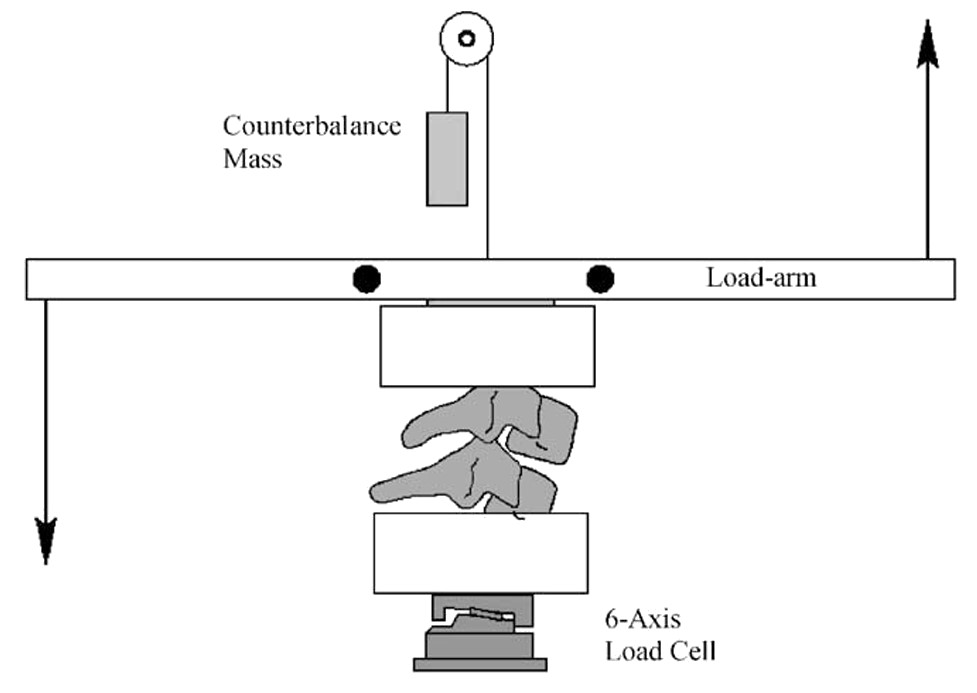{.fragment .absolute top="27%" left="60%" width="400" fragment-index=3}

:::

[Experimental setup used by Nightingale et al.]{.fragment fragment-index=3 .absolute top="68%" left="60%" width="400" style="font-size: 80%;"}

::: notes
Finally we have these studies by nightingale, where the data for male & female were reported separately & its available openly in NHTSA database. the exp setup was same for both the nightingale studies. so it can be made as a comparable study which was not done by the original author. c spine segments were cut from unembalmed pmhs and tested in flexibility & failure tests
:::

## Exploratory Data Analysis

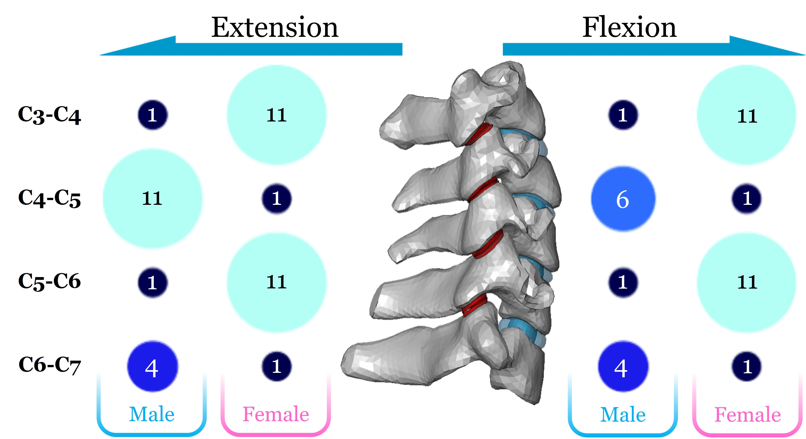{fig-align="center" height="550"}

::: notes
This slide shows no of specimens tested. just for the moment, consider c3c4 there are 11 specimens for female but there is only 1 specimen for its very adjacent c4c5 . this is because of the segmentation of fsus. same trend follows for male too but different segments.
:::

## Moment-Rotation Corridors

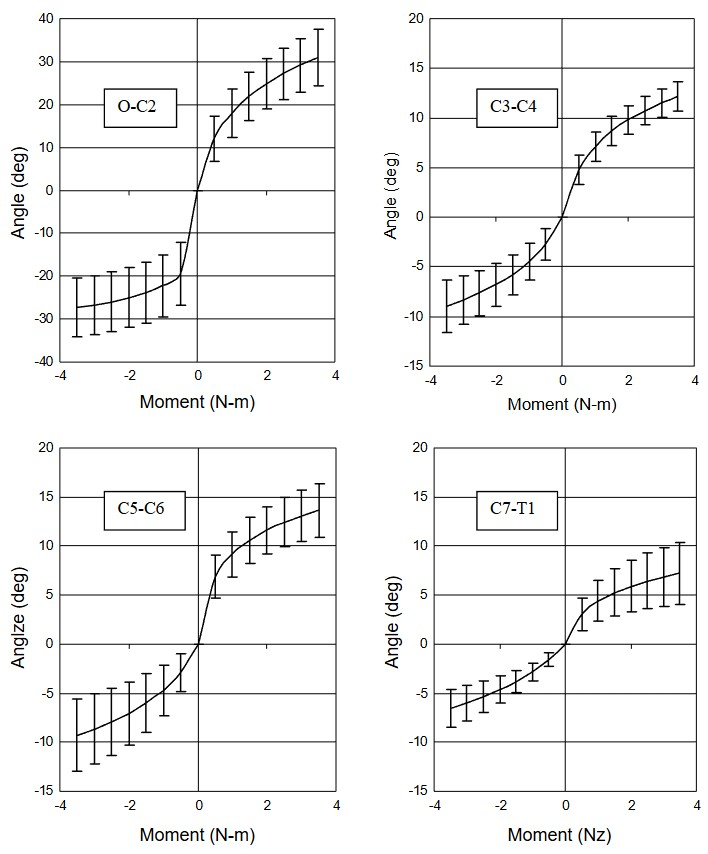{fig-align="center" height="550"}

## Current Model

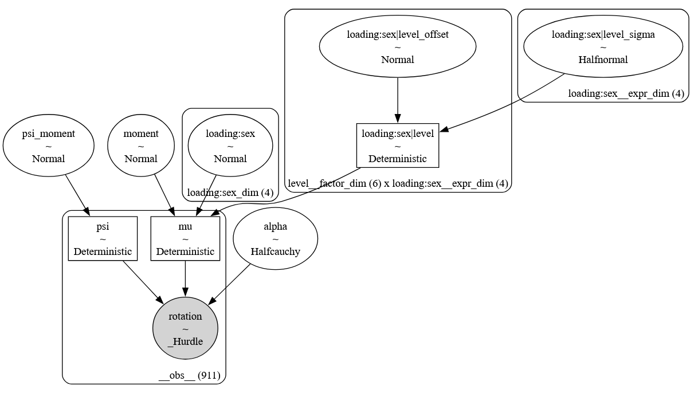{fig-align="center" height="550"}

## Contrast Plots

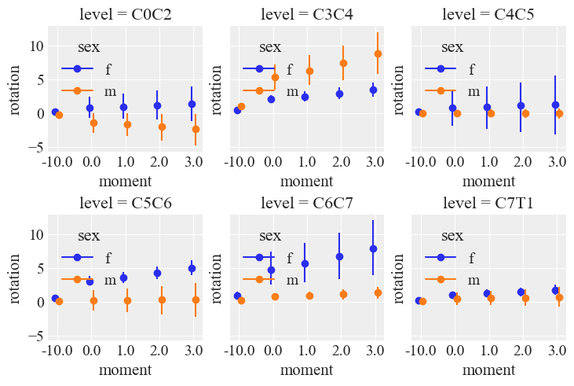{fig-align="center" height="550"}

# Rubber tube simulation - Cosserat rods

## Cosserat Rod Theory {.smaller}

**Conservation of Linear Momentum:** 

$$
\small{\rho A \cdot \partial_t^2 \bar{\mathbf{r}} = \overbrace{\partial_s \left( \frac{\mathbf{Q}^T \mathbf{S} \boldsymbol{\sigma}}{e} \right)}^{\substack{\text{internal shear/} \\ \text{stretch force}}} + \overbrace{e \ \bar{\mathbf{f}}}^{\substack{\text{external} \\ \text{force}}} }
$$

**Conservation of Angular Momentum:** 

$$
\small{\begin{align}\frac{\rho \mathbf{I}}{e} \cdot \partial_t \boldsymbol{\omega}&=\overbrace{\partial_s \left( \frac{\mathbf{B} \boldsymbol{\kappa}}{e^3} \right) + \frac{\boldsymbol{\kappa} \times \mathbf{B} \boldsymbol{\kappa}}{e^3}}^{\text{internal bend/twist couple}}+\overbrace{\left( \mathbf{Q}\frac{\bar{\mathbf{r}}_s}{e} \times \mathbf{S} \boldsymbol{\sigma} \right)}^{\substack{\text{internal shear/} \\ \text{stretch couple}}}+\overbrace{\left( \rho \mathbf{I} \cdot \frac{\boldsymbol{\omega}}{e} \right) \times \boldsymbol{\omega}}^{\text{Lagrangian transport}}+\overbrace{\frac{\rho \mathbf{I} \boldsymbol{\omega}}{e^2} \cdot \partial_t e}^{\text{unsteady dilation}}+\overbrace{e \ \mathbf{c}}^{\substack{\text{external} \\ \text{couple}}}
\end{align}}
$$

By solving these equations with suitable boundary conditions, we can model the dynamics of a single Cosserat elastic rod.

::: aside
M. Tummers, et. al., "Cosserat Rod Modeling of Continuum Robots from Newtonian and Lagrangian Perspectives," in IEEE Transactions on Robotics, vol. 39, no. 3, pp. 2360-2378, June 2023, doi: 10.1109/TRO.2023.3238171.
:::

